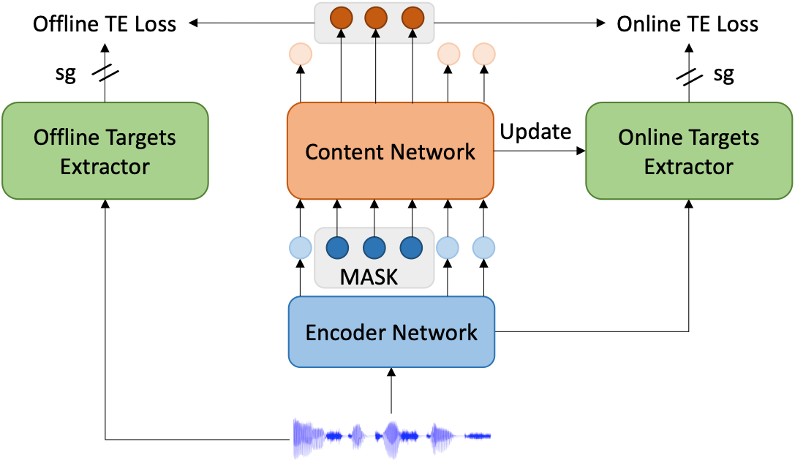

<div align="center">
    <h1>
        MT4SSL
    </h1>
    <p>
    Official PyTorch implementation of <b><em>MT4SSL: Boosting Self-Supervised Speech Representation Learning by Integrating Multiple Targets</em></b>
    </p>
    <a href="https://github.com/ddlBoJack/MT4SSL"></a>
    <a href="https://github.com/ddlBoJack/MT4SSL"></a>
    <a href="https://github.com/ddlBoJack/MT4SSL"></a>
    <a href="https://github.com/ddlBoJack/MT4SSL"></a>
</div>

## Guides

MT4SSL is a multi-task learning framework for speech-based self-supervised learning. 

MT4SSL optimizes the model with offline targets and online targets simultaneously. 

MT4SSL achieves good performance and convergence. Relatively low WER on the speech recognition task can be obtained with only a few pre-training steps. 


## Model




## Implementation

### Setup

The implementation is mainly based on the [fairseq](https://github.com/facebookresearch/fairseq) codebase. 

```bash
git clone https://github.com/pytorch/fairseq
cd fairseq
pip install --editable ./
git clone https://github.com/ddlBoJack/MT4SSL
```


### Data Preparation

We use the [LibriSpeech](http://www.openslr.org/12) dataset for implementation.

Please follow the steps [here](https://github.com/facebookresearch/fairseq/tree/main/examples/wav2vec#prepare-training-data-manifest) to prepare `*.tsv` (sources), [here](https://github.com/facebookresearch/fairseq/tree/main/examples/hubert#data-preparation) to prepare  `*.km` (K-means targets), and [here](https://github.com/facebookresearch/fairseq/tree/main/examples/wav2vec#prepare-training-data-manifest) to prepare `*.ltr` (supervised targets). 


### Pre-train the proposed MT4SSL

```bash
python fairseq_cli/hydra_train.py \
    --config-dir MT4SSL/code/config/pretraining  \
    --config-name base_librispeech  \
    checkpoint.save_dir=${pretrain_dir}  \
    task.data=${data_dir}  \
    task.label_dir=${label_dir} \
    task.label_type=km \
    common.user_dir=MT4SSL/code \
```

You can simulate $16$ GPUs by using $k$ GPUs and adding command line parameters `distributed_training.distributed_world_size=k` `+optimization.update_freq='[x]'` where $x = 16/k$.


### Fine-tune  a CTC model

```bash
python fairseq_cli/hydra_train.py  \
    --config-dir MT4SSL/code/config/finetuning \
    --config-name base_10h  \
    checkpoint.save_dir=${finetune_dir}  \
    task.data=${data_dir}   \
    model.w2v_path=${pretrain_dir} \
    common.user_dir=MT4SSL/code \
```

You can simulate $8$ GPUs by using $k$ GPUs and adding command line parameters `distributed_training.distributed_world_size=k` `+optimization.update_freq='[x]'` where $x = 8/k$.


### Decode

Decode with Viterbi algorithm:

```bash
python examples/speech_recognition/new/infer.py \
    --config-dir examples/speech_recognition/new/conf \
    --config-name infer \
    task=audio_finetuning \
    task.data=${data_dir} \
    task.labels=ltr \
    task.normalize=true \
    dataset.gen_subset=dev_clean,dev_other,test_clean,test_other \
    decoding.type=viterbi  \
    decoding.beam=1500  \
    common_eval.path=${finetune_dir}/checkpoint_best.pt \
    common.user_dir=MT4SSL/code \
```


Decode with the 4-gram language model using [flashlight](https://github.com/flashlight/flashlight/tree/main/bindings/python) and [kenlm](https://github.com/kpu/kenlm): 

```bash
python examples/speech_recognition/new/infer.py \
    --config-dir examples/speech_recognition/new/conf \
    --config-name infer \
    task=audio_finetuning \
    task.data=${data_dir} \
    task.labels=ltr \
    task.normalize=true \
    dataset.gen_subset=dev_clean,dev_other,test_clean,test_other \
    decoding.type=kenlm  \
    decoding.lmweight=2 decoding.wordscore=-1 decoding.silweight=0 \
    decoding.beam=1500 \
    decoding.lexicon=${lexicon_dir} \
    decoding.lmpath=${lm_dir} \
    common_eval.path=${finetune_dir}/checkpoint_best.pt \
    common.user_dir=MT4SSL/code \
```


## Citation

Coming soon. 


## License

This repository is under the [MIT license](https://github.com/ddlBoJack/MT4SSL/blob/main/LICENSE). 